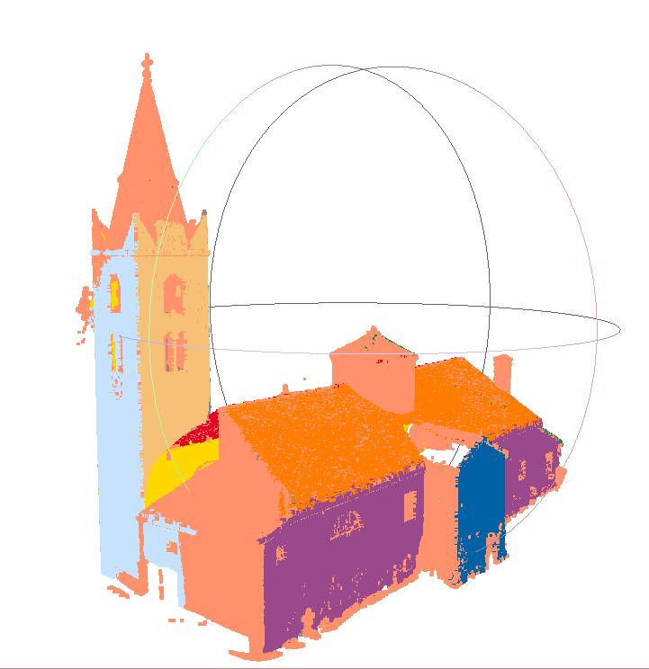
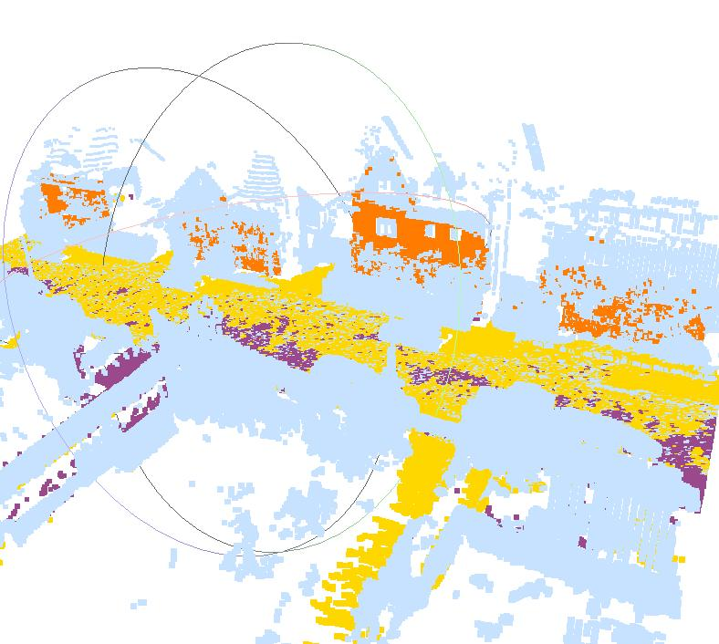

# RANSAC 3D

RANdom SAmple Consensus algorithm implemented in C++ for a course of point cloud processing.

## Contributors

- Adrien ANTON LUDWIG
- Adèle PLUQUET

## Usage

```bash
$ mkdir build && cd build
$ cmake ..
$ make
$ ./main <path_to_point_cloud (.obj file)> [<max number of planes to detect>] [<min ratio of inliers>]
$ meshlab ../data/multi_ransac.obj # to visualize the result
```

## Results

Church | Road
---|---
 | 